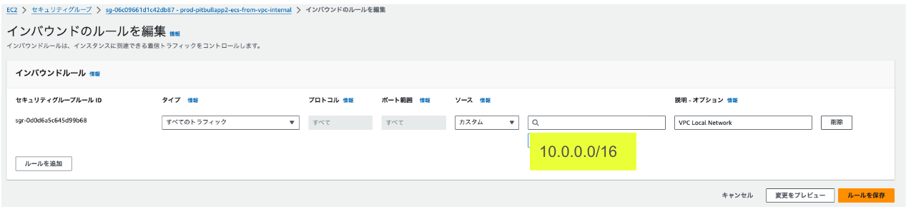
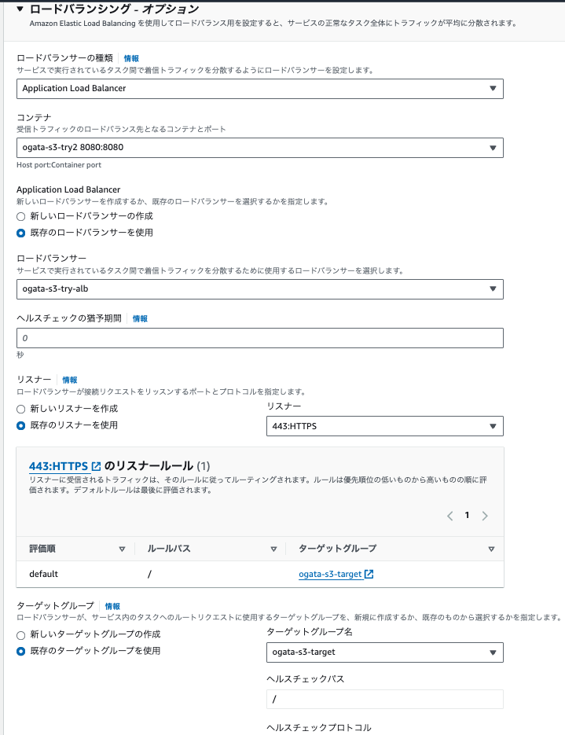

# AmazonS3-presignedUrl

<details open="open">
<summary>目次</summary>


- [今回のシステム概要図](#今回のシステム概要図)
- [環境セットアップ](#環境セットアップ)
- [AWSの設定](#AWSの設定)
- [ChatGPT](#ChatGPT)
- [参考](#参考)
- [AWS番外編](#AWS番外編)

</details>

# 今回のシステム概要図
<details>
<summary> システム概要図</summary>


</details>

# 環境セットアップ

<details>
<summary> 1. 必要ライブラリーのインポート</summary>

```gradlew.kts
    implementation("com.amazonaws:aws-java-sdk-s3:1.12.583")
```
</details>

<details>
<summary> 2. ローカル環境ではMinIOを使用</summary>

- S3と同じオブジェクト型のストレージ
- API等は全てS3に準拠している

```docker-compose.yml
services:
  minio:
    image: minio/minio:RELEASE.2023-11-01T18-37-25Z
    networks:
      - local-dev-net
    container_name: minio
    environment:
      MINIO_ROOT_USER: root
      MINIO_ROOT_PASSWORD: password
    command:
      server /data --console-address ":9001" #<- /dataで /dataディレクトリをデータストレージとして使用。 --console-address ":9001"でMiniOの管理コンソールを設定
    ports:
      - 9000:9000 #<- APIアクセス用のポート
      - 9001:9001 #<- 管理コンソールアクセス用
  createbuckets:
    image: minio/mc
    networks:
      - local-dev-net
    depends_on:
      - minio
    entrypoint: >
      /bin/sh -c "
      /usr/bin/mc alias set minio http://minio:9000 root password;
      /usr/bin/mc mb minio/s3-presignedurl-test;
      /usr/bin/mc anonymous set public minio/s3-presignedurl-test;
      exit 0
      "
```

```application.yml
aws:
  s3:
    bucket: s3-presignedurl-test
    endpoint: http://localhost:9000
    region: not_in_use
    use-minio: true
```

</details>

<details>
<summary> 3.aws環境のymlファイル</summary>

```application-sandbox.yml
aws:
  s3:
    bucket: ${S3_BUCKET_NAME}
    endpoint: ${S3_ENDPOINT}
    region: ${S3_REGION}
    use-minio: false
```
</details>

<details>
<summary> 4.ローカル、AWS環境両方に対応したS3Config.ktを作成</summary>

- Bean登録されているのでApplicationが起動した際に読み込まれる
- 呼び出し時に特にエンドポイントの指定等はしないが、Bean登録の結果自動で認識できている

```kotlin
    package com.presignedurl.backend.config

import com.amazonaws.ClientConfiguration
import com.amazonaws.auth.AWSStaticCredentialsProvider
import com.amazonaws.auth.BasicAWSCredentials
import com.amazonaws.client.builder.AwsClientBuilder
import com.amazonaws.services.s3.AmazonS3
import com.amazonaws.services.s3.AmazonS3ClientBuilder
import org.springframework.beans.factory.annotation.Value
import org.springframework.context.annotation.Bean
import org.springframework.context.annotation.Configuration

@Configuration
class S3Config(
    @Value("\${aws.s3.endpoint}")
    private val endpoint: String,

    @Value("\${aws.s3.region}")
    private val region: String,

    @Value("\${aws.s3.use-minio}")
    private val useMinIO: Boolean,

    @Value("\${aws.s3.bucket}")
    val bucket: String
) {
    @Bean
    fun baseS3Url(): String {
        return if (useMinIO) {
            "$endpoint/$bucket"
        } else {
            "https://$bucket.s3.$region.amazonaws.com"
        }
    }

    @Bean
    fun amazonS3(): AmazonS3 {
        val endpointConfiguration = AwsClientBuilder.EndpointConfiguration(
            endpoint,
            region
        )
        val clientConfiguration = ClientConfiguration()
        clientConfiguration.connectionTimeout = 10000
        clientConfiguration.requestTimeout = 10000

        val clientBuilder = AmazonS3ClientBuilder
            .standard()
            .withEndpointConfiguration(endpointConfiguration)
            .withPathStyleAccessEnabled(true)
            .withClientConfiguration(clientConfiguration)

        if (useMinIO) {
            clientBuilder.withCredentials(AWSStaticCredentialsProvider(BasicAWSCredentials("root", "password")))
        }

        return clientBuilder.build()
    }
}

```
</details>

<details>
<summary> 5.ローカルからもS3を使用するパターン（IAMのアクセスキー等が必要）</summary>

```kotlin
import com.amazonaws.ClientConfiguration
import com.amazonaws.auth.AWSStaticCredentialsProvider
import com.amazonaws.auth.BasicAWSCredentials
import com.amazonaws.client.builder.AwsClientBuilder
import com.amazonaws.services.s3.AmazonS3
import com.amazonaws.services.s3.AmazonS3ClientBuilder
import org.springframework.beans.factory.annotation.Value
import org.springframework.context.annotation.Bean
import org.springframework.context.annotation.Configuration

@Configuration
class S3Config(
    @Value("\${aws.access-key}")
    private val accessKey: String,

    @Value("\${aws.secret-key}")
    private val secretKey: String,

    @Value("\${aws.s3.region}")
    private val region: String,

    @Value("\${aws.s3.endpoint}")
    private val endpoint: String,

    @Value("\${aws.s3.bucket}")
    val bucket: String
) {

    @Bean
    fun amazonS3(): AmazonS3 {
        val endpointConfiguration = AwsClientBuilder.EndpointConfiguration(
            endpoint,
            region
        )
        val clientConfiguration = ClientConfiguration()
        clientConfiguration.connectionTimeout = 10000
        clientConfiguration.requestTimeout = 10000

        return AmazonS3ClientBuilder
            .standard()
            .withEndpointConfiguration(endpointConfiguration)
            .withPathStyleAccessEnabled(true)
            .withClientConfiguration(clientConfiguration)
            .withCredentials(AWSStaticCredentialsProvider(BasicAWSCredentials(accessKey, secretKey)))
            .build()
    }
}

```


```application-sandbox.yml
aws:
  access-key: ${AWS_IAM_ACCESS_KEY}
  secret-key: ${AWS_IAM_ACCESS_SECRET}
  s3:
    region: "region"
    bucket: "buketname"
    endpoint: "aws-endpoint"
```
</details>

# AWSの設定

<details>
<summary> 1. 必要なロールの登録</summary>

- PresignedUrlを発行するには下記の①or②のどちらかが必要。今回は②で実施
- ①S3へのアクセス権限を持ったIAMユーザーのアクセスキーandシークレットキー。もう一個のS3検討用のリポジトリーはそっちで記載
- ②AWS上にデプロイされたリソースに、S3へのアクセス権限を委譲できるIAMロールがアタッチされている
- 今回は下記のように、ECSのタスクにS3FullAccessをつけている

 

</details>

<details>
<summary> 2. S3のCORSポリシー設定</summary>

- 通常CrossOriginエラーが発生するため、下記のようにアクセスを許可するポリシーをS3に設定

```json
[
    {
        "AllowedHeaders": [
            "*"
        ],
        "AllowedMethods": [
            "GET",
            "PUT",
            "POST",
            "HEAD",
            "DELETE"
        ],
        "AllowedOrigins": [
            "*"
        ],
        "ExposeHeaders": []
    }
]
```

</details>

<details>
<summary> 3. 必要なシークレットキーを設定（キー名はapplication-sandbox.yml参照）</summary>


</details>

# ChatGPT
<details>
<summary> 1. フォルダ階層を持ちたい場合</summary>


</details>

# 参考
- [S3へのアクセス権限について](https://qiita.com/tmiki/items/87697d3d3d5330c6fc08)
- [presignedUrlについて①](https://www.dtreelabs.com/blog/s3-direct-file-upload-using-presigned-url-from-react-and-rails)
- [presignedUrlについて②](https://dev.to/aws-builders/working-with-amazon-s3-presigned-urls-in-spring-boot-383n)


# AWS番外編

<details>
<summary> 1. Cloud9→RDSへのアクセス</summary>

- 接続方法はSSHの方を選択
- RDSにアクセスに行くために、Cloud9が立てたEC2インスタンスのセキュリティグループを確認して、RDSのセキュリティグループの許可トラフックにそのセキュリティグループを設定
- ただし、セキュリティグループの設定がめんどくさければ、VPC内からの全てのトラフィックを許可する下記の設定でも問題ない。（IPは設定してあるVPCもしくはもっと絞るなら、サーバーがおかれるサブネットにする）



- Cloud9に入ったら下記コマンド

```zh
sudo yum search postgresql
sudo yum -y install postgresql15.x86_64
```

- psqlコマンドが使えるようになったら下記コマンドでPOSTGRESに入る
- PWはシークレットから取ってくる

```zh
psql -h <RDSエンドポイント> -U <ユーザー名> -d <DB名>
```

- DBの一覧の確認
```zh
\l 
```

- 指定したDBに移動
```zh
\c <DB名> 
```

- DB内のテーブル確認
```zh
\dt 
```
</details>

<details>
<summary> 2. TaskリビジョンUPにターゲットIPを自動追従</summary>

- TaskのリビジョンUP毎にターゲットのIPを変更しないといけない。。。→サービス作成の時にロードバランシング設定ので作成したALB、ターゲットグループを選択しておくと問題なくTaskのリビジョンUPに追従してルーティングされる。TaskのコンテナリッスンPortはバックエンドのポート（8080）にしておくこと！！！




</details>

<details>
<summary> 3. 他少しハマったところ</summary>

- ターゲットグループのヘルスチェックがHealthyにならない→各リソースのセキュリティグループのインバウンド/アウトバウンドをしっかり確認して！！
- Task定義で指定するチップ。X86対応のイメージか、ARM64対応のイメージかで選択するチップが異なる。今回はARM64で実施

</details>

<details>
<summary> 4.バケットポリシーで穴あけする場合（S3に設定）</summary>

```json
{
    "Version": "2012-10-17",
    "Statement": [
        {
            "Effect": "Allow",
            "Principal": "*",
            "Action": "s3:GetObject",
            "Resource": "arn:aws:s3:::backet-name/*",
            "Condition": {
                "IpAddress": {
                    "aws:SourceIp": [
                        "穴あけしたいIP（複数指定可能）"
                    ]
                }
            }
        }
    ]
}
```

</details>